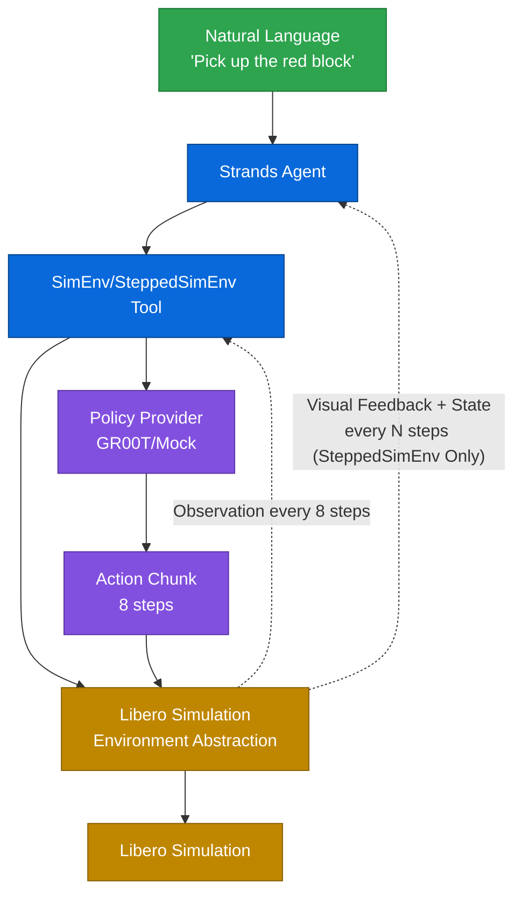
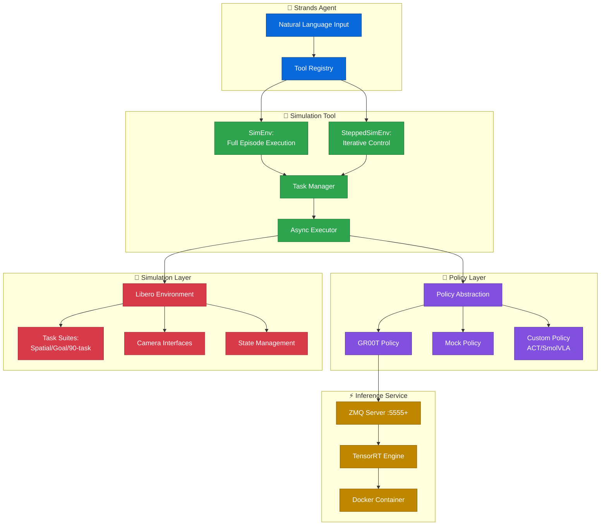

# Strands Robots Simulation

Robot control for Strands Agents in simulated environments.

## Key Benefits

**Enables rapid prototyping and algorithm development in a safe, simulated environment without requiring physical robotic hardware.** Perfect for iterating on agent strategies, testing VLA policies, and validating approaches before real-world deployment.

## How it Works

The framework operates through a streamlined pipeline that enables natural language control of simulated robots:



Users provide natural language instructions to a Strands Agent, which routes requests to simulation tools (`SimEnv` or `SteppedSimEnv`). These tools manage task execution asynchronously while communicating with a policy provider (GR00T or mock implementation) to generate action sequences. Action chunks—comprising 8 steps—are then transmitted to the simulation environment through Libero's interface. The simulation executes steps sequentially without real-time constraints. Visual observations and state feedback flow back to the agent for monitoring or iterative control.

## Installation

### Development Installation

```bash
git clone https://github.com/strands-labs/robots-sim
cd robots-sim
conda env create -f environment.yml
```

**⚠️ Requires Isaac-GR00T Docker Container**

### Prerequisites

```bash
bash scripts/setup-gr00t-gpu.sh
```

## Quick Start

### Standard Execution (SimEnv)
```bash
# Run with default 10 episodes
python examples/libero_example.py

# Run with specific number of episodes
python examples/libero_example.py --max-episodes 1
```

### Iterative Control (SteppedSimEnv)
```bash
# Run with default 1 episode (single attempt)
python examples/libero_stepped_example.py

# Run with up to 3 episode attempts (agent can reset and retry)
python examples/libero_stepped_example.py --max-episodes 3
```

### Batch Experiments

Run multiple experiments with automated success tracking and logging:

```bash
# Run 10 experiments (default) with SimEnv
./scripts/run_exp_libero_example.sh

# Run 50 experiments with SimEnv
./scripts/run_exp_libero_example.sh 50

# Run 10 experiments (default) with SteppedSimEnv
./scripts/run_exp_libero_stepped_example.sh

# Run 25 experiments with SteppedSimEnv
./scripts/run_exp_libero_stepped_example.sh 25
```

Experiment logs are saved to `exps/` folder with:
- Success/failure tracking (reward = 1.0)
- Duration per run
- Task names
- Detailed output
- Summary statistics with success rate

Log file format: `exps/libero_example_YYYYMMDD_HHMMSS.log`

When you run the examples, videos will be automatically saved to the `./rollouts/` folder, organized by date. Each episode generates a side-by-side video showing both camera views:


*Example: Robot putting frying pan on cabinet shelf in Libero-90 task suite*

Videos are saved with descriptive filenames:
```
rollouts/YYYY_MM_DD/YYYY_MM_DD_HH_MM_SS--episode=N--success=True--task=description.mp4
```

## Features

- **Two Execution Modes**
  - **SimEnv** - Full episode execution with final results
  - **SteppedSimEnv** - Iterative control with visual feedback per batch
- **Libero Simulation** - Full support for Libero benchmark environments
- **GR00T Policy Integration** - Isaac-GR00T VLA policy support via ZMQ
- **Policy Abstraction** - Extensible interface for VLA providers (GR00T implemented, designed for ACT, SmolVLA, etc.)
- **Video Recording** - Capture simulation episodes as MP4 videos
- **Async Execution** - Non-blocking simulation with status monitoring
- **Mock Environment** - Fast testing without dependencies
- **Strands Tools** - GR00T inference service management

## Architecture Overview

The system comprises five interconnected layers that work together to enable natural language robot control in simulation:



This modular design enables developers to swap policy implementations or simulation environments without restructuring core logic. The control loop executes steps sequentially with observation collection from cameras and joint sensors, feeding this data to policy models that generate motor commands in fixed-size action horizons.

## Project Structure

```
strands-robots-sim/
├── strands_robots_sim/
│   ├── __init__.py           # Package exports
│   ├── sim_env.py            # Full episode execution
│   ├── stepped_sim_env.py    # Iterative agent control
│   ├── envs/                 # Environment implementations
│   │   ├── __init__.py       # Environment factory
│   │   ├── base.py           # Base environment interface
│   │   └── env_libero.py     # Libero integration
│   ├── policies/             # Policy abstraction
│   │   ├── __init__.py       # Policy base + factory
│   │   └── groot/            # GR00T implementation
│   │       ├── __init__.py
│   │       ├── client.py     # ZMQ client
│   │       └── data_config.py # Embodiment configs
│   └── tools/                # Strands tools
│       ├── __init__.py
│       └── gr00t_inference.py  # Docker service manager
├── examples/
│   ├── libero_example.py           # Standard SimEnv example (--max-episodes)
│   └── libero_stepped_example.py   # SteppedSimEnv example (--max-episodes)
├── tests/                    # Comprehensive test suite
└── scripts/                  # Setup and experiment scripts
    ├── setup-gr00t-gpu.sh           # GR00T Docker setup
    ├── run_exp_libero_example.sh    # Batch experiments (SimEnv)
    └── run_exp_libero_stepped_example.sh  # Batch experiments (SteppedSimEnv)
```

## System 1 vs System 2 Thinking in Robot Control

This framework implements a **dual-system architecture** inspired by cognitive science (Kahneman's System 1 and System 2 thinking):

```
┌─────────────────────────────────────────────────────────────────┐
│                     SYSTEM 2: Deliberate Planning               │
│  ┌───────────────────────────────────────────────────────────┐  │
│  │  Strands Agent (Claude LLM)                               │  │
│  │  • High-level task reasoning and planning                 │  │
│  │  • Natural language understanding                         │  │
│  │  • Task decomposition and strategy adaptation             │  │
│  │  • Error detection and recovery planning                  │  │
│  └───────────────────────────────────────────────────────────┘  │
│                              ↓                                  │
│                   Language Instructions                         │
│                   "move gripper to block"                       │
│                              ↓                                  │
└─────────────────────────────────────────────────────────────────┘

┌─────────────────────────────────────────────────────────────────┐
│                   SYSTEM 1: Fast Action Execution               │
│  ┌───────────────────────────────────────────────────────────┐  │
│  │  GR00T VLA Policy (Vision-Language-Action Model)          │  │
│  │  • Sensorimotor control and fast reactions                │  │
│  │  • Vision + Language → Robot Actions                      │  │
│  │  • Low-level trajectory execution                         │  │
│  │  • Real-time feedback processing                          │  │
│  └───────────────────────────────────────────────────────────┘  │
│                              ↓                                  │
│                     Robot Actions                               │
│                  [joint positions, gripper state]               │
│                              ↓                                  │
│  ┌───────────────────────────────────────────────────────────┐  │
│  │  Libero Simulation Environment                            │  │
│  │  • Physics simulation and rendering                       │  │
│  │  • State updates and reward computation                   │  │
│  └───────────────────────────────────────────────────────────┘  │
└─────────────────────────────────────────────────────────────────┘
```

### Why This Matters

**System 2 (Strands Agent)** provides:
- **Deliberate reasoning**: Can break down complex tasks into subtasks
- **Contextual understanding**: Interprets high-level goals and environmental context
- **Adaptive planning**: Adjusts strategy based on visual feedback and task progress
- **Error recovery**: Detects failures and generates alternative approaches

**System 1 (GR00T VLA)** provides:
- **Fast execution**: 40-160ms inference latency for real-time control
- **Sensorimotor skills**: Learned visuomotor policies for manipulation
- **Generalization**: Pre-trained on diverse tasks, adapts to new instructions
- **Reactive control**: Handles low-level motor commands without explicit planning

### Two Modes of Collaboration

1. **SimEnv Mode (Single System 2 Call)**
   - System 2 generates complete task description once
   - System 1 executes entire episode autonomously
   - Best for: Well-defined tasks, benchmarking

2. **SteppedSimEnv Mode (Iterative System 2 Guidance)**
   - System 2 observes progress and provides guidance every N steps
   - System 1 executes short action sequences
   - System 2 adapts instructions based on visual feedback
   - Best for: Complex tasks, error-prone scenarios, research

## Execution Modes

### Mode 1: SimEnv - Direct Task Execution

Agent specifies task once, policy runs to completion.

```python
from strands import Agent
from strands_robots_sim import SimEnv, gr00t_inference

# Create simulation environment
sim_env = SimEnv(
    tool_name="my_sim",
    env_type="libero",
    task_suite="libero_spatial",  # or libero_goal, libero_90, etc.
    data_config="libero"
)

agent = Agent(tools=[sim_env, gr00t_inference])

# Start GR00T service
agent.tool.gr00t_inference(
    action="start",
    checkpoint_path="/data/checkpoints/gr00t-libero-spatial",
    port=8000,
    data_config="libero"
)

# Execute task (blocking)
agent.tool.my_sim(
    action="execute",
    instruction="pick up the red block",
    policy_port=8000,
    max_episodes=5,
    max_steps_per_episode=200,
    record_video=True,
    video_path="./demo.mp4"
)

# Or start async execution
agent.tool.my_sim(
    action="start",
    instruction="stack the blocks",
    policy_port=8000,
    max_episodes=10
)

# Monitor progress
agent.tool.my_sim(action="status")

# Stop task
agent.tool.my_sim(action="stop")
```

### Mode 2: SteppedSimEnv - Iterative Agent Control

Agent observes and adapts every N steps with visual feedback.

```python
from strands import Agent
from strands_robots_sim import SteppedSimEnv, gr00t_inference

# Create stepped simulation environment
stepped_sim = SteppedSimEnv(
    tool_name="my_stepped_sim",
    env_type="libero",
    task_suite="libero_10",
    data_config="libero_10",
    steps_per_call=10,  # Execute 10 steps per call
    max_steps_per_episode=500
)

agent = Agent(
    model="us.anthropic.claude-sonnet-4-5-20250929-v1:0",
    tools=[stepped_sim, gr00t_inference]
)

# Start GR00T service
agent.tool.gr00t_inference(
    action="start",
    checkpoint_path="/data/checkpoints/gr00t-n1.5-libero-90-posttrain",
    port=8000,
    data_config="examples.Libero.custom_data_config:LiberoDataConfig"
)

# Reset episode
agent.tool.my_stepped_sim(
    action="reset_episode",
    task_name="KITCHEN_SCENE1_put_the_black_bowl_on_top_of_the_cabinet"
)

# Execute steps iteratively
agent.tool.my_stepped_sim(
    action="execute_steps",
    instruction="move gripper toward the bowl",
    policy_port=8000,
    num_steps=10
)
# Returns: camera images (base64), state, reward, episode_done status

# Agent can now:
# - Observe camera images and state
# - Decide next instruction
# - Continue, retry, or stop based on progress

# Get current state
agent.tool.my_stepped_sim(action="get_state")
```

**Key Differences:**

| Feature | SimEnv | SteppedSimEnv |
|---------|--------|---------------|
| Control Flow | One-shot execution | Step-by-step iteration |
| Agent Feedback | Final reward only | Camera images + state per batch |
| Use Case | Known tasks | Complex tasks requiring adaptation |
| Execution Speed | Faster | Slower (more control) |
| Error Recovery | None | Adaptive retry possible |
| Visual Grounding | None | Camera feedback available |

**Why SteppedSimEnv?**

- **Visual Grounding**: Agent sees camera feeds and can verify progress at each step
- **Error Recovery**: Can detect failures and retry with different instructions
- **Hierarchical Planning**: Natural decomposition of complex tasks into subtasks
- **Interpretability**: Full trace of agent decisions and observations
- **Adaptive Control**: Agent can adjust strategy based on real-time feedback

### Supported Task Suites

**Libero Environments:**
- **libero_spatial** - Spatial reasoning tasks (10 tasks)
- **libero_object** - Object-centric tasks (10 tasks)
- **libero_goal** - Goal-conditioned manipulation (10 tasks)
- **libero_10** - Standard 10-task benchmark
- **libero_90** - Extended 90-task benchmark (comprehensive evaluation set)

## Policy Providers

### Currently Implemented

**GR00T Policy** - Production-ready VLA policy
```python
from strands_robots_sim import create_policy

# GR00T policy (requires Isaac-GR00T Docker container)
policy = create_policy(
    provider="groot",
    data_config="libero",
    host="localhost",
    port=8000
)
```

**Mock Policy** - For testing and development
```python
# Mock policy (no dependencies, returns random actions)
policy = create_policy(provider="mock")
```

### Architecture for Extensibility

The codebase uses a `Policy` abstract base class to support multiple VLA providers:

```python
class Policy(ABC):
    @abstractmethod
    async def get_actions(self, observation_dict, instruction, **kwargs):
        """Get actions from policy given observation and instruction."""
        pass
```

**Currently Available:**
- ✅ **groot** - Isaac-GR00T VLA policy (fully implemented)
- ✅ **mock** - Mock policy for testing (fully implemented)

**Designed For (Not Yet Implemented):**
- ⏳ **act** - Action Chunking Transformer (architecture ready, implementation needed)
- ⏳ **smolvla** - SmolVLA (architecture ready, implementation needed)
- ⏳ Custom VLA providers can be added by extending the `Policy` base class

**To Add a New VLA Provider:**

1. Create a new directory under `strands_robots_sim/policies/your_vla/`
2. Implement `YourVlaPolicy` class extending the `Policy` base class
3. Implement required methods:
   - `async def get_actions(observation_dict, instruction, **kwargs)`
   - `def set_robot_state_keys(robot_state_keys)`
   - `@property def provider_name()`
4. Update `create_policy()` factory function in `policies/__init__.py`

Example structure:
```python
from strands_robots_sim.policies import Policy

class YourVlaPolicy(Policy):
    async def get_actions(self, observation_dict, instruction, **kwargs):
        # Your VLA inference logic here
        return actions
```

## GR00T Inference Service

**⚠️ Requires Isaac-GR00T Docker Container**

### Prerequisites

```bash
bash scripts/setup-gr00t-gpu.sh
```

### Usage

```python
# Find available containers
agent.tool.gr00t_inference(action="find_containers")

# Start inference service
agent.tool.gr00t_inference(
    action="start",
    checkpoint_path="/data/checkpoints/model",
    port=8000,
    data_config="libero",
    denoising_steps=4
)

# Check status
agent.tool.gr00t_inference(action="status", port=8000)

# List all services
agent.tool.gr00t_inference(action="list")

# Stop service
agent.tool.gr00t_inference(action="stop", port=8000)
```

## Data Configurations

Available GR00T data configurations:

**Simulation:**
- `libero` - Standard Libero configuration
- `libero_spatial` - Libero spatial tasks
- `libero_goal` - Goal-conditioned tasks
- `libero_meanstd` - Mean-std normalization

**Humanoid Robots:**
- `fourier_gr1_arms_only` - Fourier GR-1 arms
- `unitree_g1` - Unitree G1 humanoid
- `bimanual_panda_gripper` - Bimanual Panda

## Testing

The project includes comprehensive test coverage for different scenarios:

### Test Structure

```
tests/
├── test_mock.py           # Mock environment tests (no dependencies)
├── test_libero_fast.py    # Fast Libero tests with zero actions
└── test_libero_mock.py    # Mock scenarios for Libero + GR00T
```

### Running Tests

**Run all tests:**
```bash
pytest tests/ -v
```

**Run specific test suites:**
```bash
# Mock tests (no dependencies - fastest)
pytest tests/test_mock.py -v

# Libero tests (requires: pip install strands-robots-sim[sim])
pytest tests/test_libero_fast.py -v

# Mock Libero + GR00T tests
pytest tests/test_libero_mock.py -v
```

**Run with markers:**
```bash
# Run only mock tests
pytest -m mock -v

# Run only Libero tests
pytest -m libero -v
```

**Run specific tests:**
```bash
# Test fully mocked simulation (no dependencies)
pytest tests/test_libero_mock.py::test_fully_mock_simulation -v

# Test Libero with mock GR00T
pytest tests/test_libero_mock.py::test_libero_with_mock_groot -v

# Test fast Libero simulation
pytest tests/test_libero_fast.py::test_fast_libero_simulation -v
```

### Test Scenarios

#### 1. Mock Tests (`test_mock.py`)
- **Requirements**: None - fully mocked
- **Purpose**: Fast testing without any dependencies
- **Best for**: CI/CD pipelines, quick validation

#### 2. Fast Libero Tests (`test_libero_fast.py`)
- **Requirements**: `pip install strands-robots-sim[sim]`
- **Purpose**: Real Libero environment with zero actions (no policy)
- **Best for**: Verifying Libero integration without GR00T overhead

#### 3. Mock Libero + GR00T (`test_libero_mock.py`)
- **Requirements**: Varies by test
  - `test_fully_mock_simulation`: No dependencies
  - `test_libero_with_mock_groot`: Requires Libero
  - `test_mock_agent_with_tools`: No dependencies
- **Purpose**: Test different mock scenarios and combinations
- **Best for**: Testing without full GR00T Docker setup

## Examples

### Full Examples

The `examples/` directory contains complete working examples:

**1. SimEnv Example** (`examples/libero_example.py`)
- Standard execution mode
- Full episode execution with GR00T policy
- Demonstrates direct task completion
- Videos automatically saved to `./rollouts/`

```bash
python examples/libero_example.py
```

**2. SteppedSimEnv Example** (`examples/libero_stepped_example.py`)
- Iterative control mode
- Agent-driven planning with visual feedback
- Task decomposition demonstration
- Shows hierarchical planning patterns

```bash
python examples/libero_stepped_example.py
```

### Testing Examples

For testing without full requirements:
- `tests/test_mock.py` - Mock environment tests (no dependencies)
- `tests/test_libero_fast.py` - Fast Libero tests with zero actions
- `tests/test_libero_mock.py` - Mock scenarios for different testing needs

## Performance & Overhead

### SimEnv Mode (Direct Execution)

When using natural language interface with `agent("Run the task...")`, expect ~5-8 seconds overhead on top of actual simulation time:

| Component | Overhead | Notes |
|-----------|----------|-------|
| LLM Call | 3-5s | Largest bottleneck - agent processes language, decides tool, generates parameters |
| Environment Reset | 0.5-1s | Loading initial state, physics engine initialization |
| Video Encoding | 0.5-1s | Encoding frames to MP4 |
| Policy Communication | 0.2-0.5s | ZMQ communication with GR00T |
| Python Setup | 0.5-1s | Import overhead (first run) |

**Example:** A 9-second simulation takes ~14-17 seconds total.

### SteppedSimEnv Mode (Iterative Control)

SteppedSimEnv operates on **1 episode per run** with iterative agent control. It has **significantly higher overhead** due to multiple LLM calls:

| Component | Overhead | Notes |
|-----------|----------|-------|
| Base Setup | 5-10s | Initial environment and policy setup |
| LLM per Iteration | 3-5s | Agent observes, reasons, decides (repeated N times) |
| Total | **~5-10s + (3-5s × iterations)** | Scales with task complexity |

**Example:** Task with 5 iterations = ~20-35s overhead + simulation time.

### Optimization Tips

- **For batch experiments:** Use direct tool calls to bypass LLM processing (saves 3-5s per call)
- **Disable video recording** when not needed
- **Choose mode wisely:** SimEnv for known tasks, SteppedSimEnv for complex tasks needing adaptation
- Overhead is relatively fixed for SimEnv; scales with complexity for SteppedSimEnv

See [INTRODUCTION.md](docs/INTRODUCTION.md#performance-tuning) for detailed performance tuning information.

## License

Apache-2.0

## Links

- **Documentation**: https://github.com/strands-labs/robots-sim
- **Issues**: https://github.com/strands-labs/robots-sim/issues
- **Strands SDK**: https://github.com/strands-agents/sdk-python
- **Isaac-GR00T**: https://github.com/NVIDIA/Isaac-GR00T
- **Libero**: https://github.com/Lifelong-Robot-Learning/LIBERO
